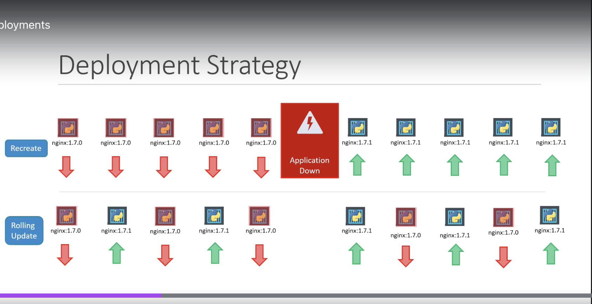

Labels, Selectors and Annotations

```yaml
apiVersion: v1
kind: Pod
metadata:
  name: simple-webapp
  labels:
    app: App1
    function: frontend 
spec:
  containers:
  - name: simple-webapp
    image: simple-webapp
    resources:
      limits:
        memory: "128Mi"
        cpu: "500m"
    ports:
      - containerPort: 8080
```

```bash
kubectl get pods --selector app=App1
```

Use matchLabel:
ReplicaSet
```yaml
apiVersion: v1
kind: ReplicationController
metadata:
  name: simple-webapp
  labels:
    app: App1
    function: front-end
spec:
  replicas: 3
  selector:
    app: App1
    function: front-end
  template:
    metadata:
      name: simple-webapp
      labels:
        app: App1
        function: front-end
    spec:
      containers:
        - name: simple-webapp
          image: simple-webapp
          ports:
            - containerPort: 8080
```
```yaml
apiVersion: v1
kind: Service
metadata:
  name: my-service
spec:
  selector:
    app: App1
  ports:
  - port: 80
    targetPort: 8080
```

Annotations:
```yaml
apiVersion: v1
kind: Pod
metadata:
  name: simple-webapp
  annotations:
    buildVersion: 1.20.31
  labels:
    app: App1
    function: frontend 
spec:
  containers:
  - name: simple-webapp
    image: simple-webapp
    resources:
      limits:
        memory: "128Mi"
        cpu: "500m"
    ports:
      - containerPort: 8080
```

Rolling Updates and Rollbacks in Deployments

```bash
kubectl rollout status deployments/myapp-deployment
```

```bash
kubectl rollout history deployments/myapp-deployment
```

Deployment Strategy


```bash
kubectl rollout undo deployments/myapp-deployment
```

This anotation show CHANGE-CAUSE in `kubectl rollout history`
```bash
kubernetes.io/change-cause: app-1.0.3
```

Jobs
CronJobs
